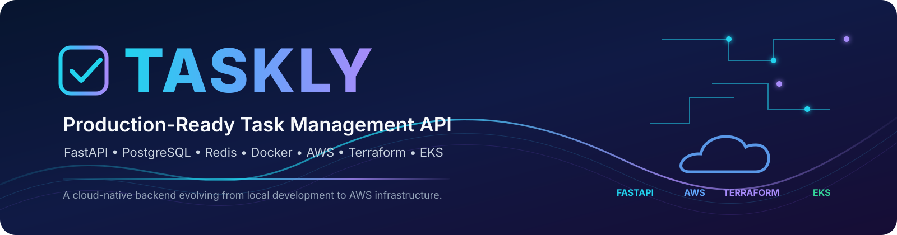

# Taskly

<p align="center">
  
</p>

<p align="center">
  <strong>Production-ready Task Management API evolving from local development to AWS cloud infrastructure.</strong>
</p>

<p align="center">
  
  
  
  
  
  
  
</p>

---

## About

Taskly is a production-oriented task management API built with **FastAPI**. The project progressively applies backend engineering, containerization, observability, and AWS infrastructure practices.

The project is currently completed through **Stage 6 — CI/CD Pipeline**.

### Current architecture

```text
                        Taskly API
                           │
             ┌─────────────┴─────────────┐
             │                           │
             ▼                           ▼
      PostgreSQL                    Redis Cache
      Amazon RDS                 Amazon ElastiCache

              AWS infrastructure managed by
                     Terraform
```


---

## Project Progress

| Stage | Area | Status |
|---|---|---|
| **Stage 1** | Application Setup & Understanding | ✅ Complete |
| **Stage 2** | Application Production Upgrade | ✅ Complete |
| **Stage 3** | Docker & Local Production Stack | ✅ Complete |
| **Stage 4** | AWS Infrastructure with Terraform | ✅ Complete |
| **Stage 5** | Kubernetes / EKS Deployment | ✅ Complete |
| **Stage 6** | CI/CD Pipeline | ✅ Complete |

---

## Technology Stack

| Layer | Technology |
|---|---|
| Language | Python 3.12 |
| API | FastAPI |
| Validation | Pydantic |
| Database | PostgreSQL |
| ORM | SQLAlchemy |
| Cache | Redis |
| Metrics | Prometheus |
| Logging | Structured JSON logging |
| Containerization | Docker |
| Local orchestration | Docker Compose |
| Infrastructure as Code | Terraform |
| Cloud | AWS |
| Kubernetes | Amazon EKS |
| Container Registry | Amazon ECR |
| Managed database | Amazon RDS PostgreSQL |
| Managed cache | Amazon ElastiCache Redis |

---

## Key Features

### API

- Task CRUD operations
- Pydantic request/response models
- `/health` health endpoint
- `/metrics` Prometheus endpoint

### Performance

- Redis caching for task-list reads
- Cache invalidation after task creation and mutations
- PostgreSQL persistence

### Observability

- Prometheus HTTP request counter
- HTTP request duration histogram
- `tasks_created_total` counter
- Structured JSON logging
- Per-request `X-Request-ID`

### Containerization

- Production Dockerfile
- Python 3.12 slim base image
- Non-root `taskly` container user
- Docker Compose application stack
- PostgreSQL persistence
- Redis service

---

# Stage 1 — Application Setup & Understanding

The original FastAPI application provides the foundation for the Taskly API.

Core API capabilities include:

```text
GET    /health
GET    /metrics
GET    /tasks
POST   /tasks
GET    /tasks/{task_id}
PATCH  /tasks/{task_id}
DELETE /tasks/{task_id}
```

The API uses Pydantic models for request/response validation and SQLAlchemy for database access.

---

# Stage 2 — Application Production Upgrade

The application was upgraded from a basic bootcamp API into a more production-oriented service.

### Improvements

- PostgreSQL database integration
- SQLAlchemy models and sessions
- Redis integration
- Redis caching
- Cache invalidation
- Structured logging
- Request ID generation
- Prometheus metrics
- Health endpoint
- Production-oriented configuration
- Dependency separation

### Observability flow

```text
HTTP Request
     │
     ├── X-Request-ID
     │
     ├── Request counter
     │
     ├── Request duration
     │
     └── Structured JSON log
```

---

# Stage 3 — Docker & Local Production Stack

Taskly was containerized and tested as a multi-service production-style local stack.

```text
                    Docker Compose
                         │
          ┌──────────────┼──────────────┐
          │              │              │
          ▼              ▼              ▼
     Taskly API     PostgreSQL        Redis
       :8000
```

### Completed

- Production Dockerfile
- `.dockerignore`
- Non-root container user
- Environment variables
- Docker Compose
- Docker networking
- PostgreSQL persistence
- Redis caching and invalidation
- Prometheus `/metrics`
- `tasks_created_total`
- JSON logging
- Request ID
- End-to-end API verification
- Docker Compose cleanup

The production image is configured to run Uvicorn on port `8000` as the non-root `taskly` user.

---

# Stage 4 — AWS Infrastructure with Terraform

The AWS infrastructure was provisioned with Terraform and verified independently before moving to Kubernetes deployment.

### AWS Region

```text
us-east-1
```

### Infrastructure

```text
                         AWS VPC
                           │
             ┌─────────────┴─────────────┐
             │                           │
       Public Subnets              Private Subnets
             │                           │
      Internet Gateway             NAT Gateway
                                         │
                         ┌───────────────┼───────────────┐
                         │               │               │
                        EKS             RDS          ElastiCache
                      Cluster        PostgreSQL          Redis
```

### Terraform-managed resources

- VPC
- Public subnets
- Private subnets
- Internet Gateway
- NAT Gateway
- Public/private route tables
- EKS subnet tags
- EKS IAM roles
- Amazon EKS cluster
- EKS managed node group
- Amazon ECR repository
- Amazon RDS PostgreSQL
- Amazon ElastiCache Redis
- Terraform outputs

### Verified AWS resources

| Resource | Identifier |
|---|---|
| Region | `us-east-1` |
| EKS cluster | `taskly-sushmitha-eks` |
| ECR repository | `taskly-sushmitha-api` |
| RDS PostgreSQL | `taskly-sushmitha-postgres` |
| ElastiCache Redis | `taskly-sushmitha-redis` |
| VPC | `vpc-0c533ed5bdd9c8e2f` |

### EKS verification

- 2 worker nodes
- Both nodes `Ready`
- Kubernetes version `v1.36.2-eks-254016e`
- `kubectl` connectivity verified

### RDS verification

- Status: `available`
- PostgreSQL port: `5432`

### Redis verification

- Status: `available`

### ECR verification

- Repository created
- Image scanning on push enabled
- Repository ready for the Stage 5 application image

---

# Infrastructure as Code

Terraform configuration is stored under:

```text
terraform/
├── main.tf
├── providers.tf
├── variables.tf
├── outputs.tf
├── terraform.tfvars
├── terraform.tfstate
├── terraform.tfstate.backup
└── .terraform.lock.hcl
```

Terraform state and sensitive configuration are protected through `.gitignore` and are **not intended to be committed to the public repository**.

---

# Repository Structure

```text
bootcamp-tasks-api/
│
├── main.py
├── database.py
├── models.py
├── redis_client.py
├── logging_config.py
├── requirements.txt
│
├── Dockerfile
├── .dockerignore
├── compose.yaml
├── .gitignore
│
├── terraform/
│   ├── main.tf
│   ├── providers.tf
│   ├── variables.tf
│   └── outputs.tf
├── k8s/
│   ├── deployment.yaml
│   ├── service.yaml
│   └── configmap.yaml
│
└── README.md
```


---

# Local Development

Create the Python environment:

```bash
python3.12 -m venv .venv
source .venv/bin/activate
```

Install dependencies:

```bash
pip install -r requirements.txt
```

Run the API locally:

```bash
uvicorn main:app --reload
```

API documentation:

```text
http://localhost:8000/docs
```

Health endpoint:

```text
http://localhost:8000/health
```

Metrics:

```text
http://localhost:8000/metrics
```

---

# Docker Development

Build and start the local production-style stack:

```bash
docker compose up --build
```

The stack provides:

```text
Taskly API
    │
    ├── PostgreSQL
    │
    └── Redis
```

---

# Security Practices

The project applies several production-oriented practices:

- Non-root Docker container user
- Separate application/database/cache configuration
- Private AWS subnets
- IAM roles for AWS services
- Security groups
- Terraform state protection
- Sensitive Terraform configuration excluded from Git
- Secrets kept outside application source

No credentials, database passwords, or Redis authentication values belong in this README.

---

# Project Roadmap

```text
Application Setup
       │
       ▼
Production Upgrade
       │
       ▼
Docker & Local Production
       │
       ▼
AWS Infrastructure
       │
       ▼
EKS Deployment
       │
       ▼
CI/CD                      ← COMPLETE
       │
       ▼
Monitoring & Logging
       │
       ▼
Security Hardening
       │
       ▼
Production-Ready Taskly
```

---

# Stage 5 — Kubernetes / EKS Deployment

Stage 5 deployed the existing production Taskly API image to the existing Amazon EKS infrastructure created in Stage 4. No Stage 4 AWS infrastructure was recreated.

### ECR Deployment

- Local image: `taskly-sushmitha-api:stage5`
- Image ID: `cbe41a93f7d4`
- ECR repository: `taskly-sushmitha-api`
- ECR tag: `stage5`
- ECR digest: `sha256:bf96a2442b8a07f411c8296c6e47b5150e335d2aa0f61a9a4bbeb1de6cdaf19b`
- ECR scan on push: enabled

### Kubernetes Deployment

- Cluster: `taskly-sushmitha-eks`
- Kubernetes version: `v1.36.2-eks-254016e`
- Replicas: `2`
- Container port: `8000`
- Image pulled successfully by both EKS nodes

Kubernetes manifests:

- `k8s/deployment.yaml`
- `k8s/service.yaml`
- `k8s/configmap.yaml`

### Configuration and Secrets

The application configuration was separated between Kubernetes ConfigMap and Secret resources.

**ConfigMap**

- `REDIS_URL`
- Existing ElastiCache Redis endpoint
- Redis database `0`
- Port `6379`

**Secret**

- `DATABASE_URL`
- Existing RDS PostgreSQL endpoint
- Database: `taskly`
- User: `tasklyadmin`
- Password stored only in the Kubernetes Secret
- No database credentials committed to Git

### Kubernetes Architecture

```text
Internet
   |
AWS Load Balancer
   |
Kubernetes LoadBalancer Service
   |
+-----------------------+
|                       |
Taskly API Pod      Taskly API Pod
|                       |
+-----------+-----------+
            |
       +----+----+
       |         |
       v         v
RDS PostgreSQL  ElastiCache Redis

```

### Health Checks and Resources

The Deployment uses:

- Startup probe on `/health`
- Readiness probe on `/health`
- Liveness probe on `/health`
- CPU request: `100m`
- Memory request: `128Mi`
- CPU limit: `500m`
- Memory limit: `512Mi`

The container also runs with production-oriented security settings:

- Non-root user
- `runAsUser: 1000`
- Privilege escalation disabled
- All Linux capabilities dropped
- `RuntimeDefault` seccomp profile

### Verification

The Stage 5 deployment was verified end-to-end.

**Deployment**

- `taskly-api` deployment: `2/2` available
- Both pods: `Running`
- Both pods: `Ready`
- Restarts: `0`

**Kubernetes Service**

- Service type: `LoadBalancer`
- External AWS Load Balancer provisioned
- Service endpoints resolved to both API pods

**API**

- `GET /health` returned HTTP `200`
- `GET /tasks` returned HTTP `200`
- `POST /tasks` returned HTTP `201`
- `GET /tasks/{id}` returned HTTP `200`

**PostgreSQL**

A task was successfully created and retrieved through the deployed API, verifying application connectivity to Amazon RDS PostgreSQL.

**Redis**

Redis connectivity was verified with `PONG`.

The `tasks:all` cache key was also verified in ElastiCache with a positive TTL, confirming Redis caching was functioning.

**Metrics**

The Prometheus metric:

```text
tasks_created_total 1.0
```

confirmed that the task creation was recorded by the deployed application.

**Logging**

Structured application logs confirmed the task creation and included the generated request ID and task ID.

**External API**

The API was successfully accessed through the AWS Load Balancer:

```text
GET /health    → HTTP 200
GET /tasks     → HTTP 200
GET /metrics   → metrics available
```
### Stage 5 Result

Stage 5 is complete. Taskly is now deployed on Amazon EKS using the production Docker image stored in Amazon ECR, with Amazon RDS PostgreSQL and Amazon ElastiCache Redis as managed backend services.

# Stage 6 — CI/CD Pipeline

Stage 6 automated the build, container publishing, Kubernetes deployment, and application verification process using GitHub Actions.

The pipeline runs automatically when changes are pushed to the `taskly-development` branch.

### CI/CD Architecture

```text
GitHub
   |
   | push to taskly-development
   v
GitHub Actions
   |
   +----------------------+
   |                      |
   v                      v
Python validation     GitHub OIDC
                          |
                          v
                    AWS IAM Role
                          |
              +-----------+-----------+
              |                       |
              v                       v
         Amazon ECR              Amazon EKS
              |                       |
              |                 Update Deployment
              |                       |
              +----------+------------+
                         |
                         v
                  Rollout Verification
                         |
                         v
                LoadBalancer /health

### GitHub Actions Workflow

Workflow file:

```text
.github/workflows/cicd.yml
```
### CI/CD Verification

The GitHub Actions pipeline was successfully executed from the `taskly-development` branch.

The successful workflow verified:

- Python application validation completed successfully
- GitHub OIDC authentication with AWS succeeded
- AWS identity verification succeeded
- Docker image was built successfully
- Docker image was pushed to Amazon ECR
- Kubernetes access to Amazon EKS succeeded
- `taskly-api` deployment was updated with the new image
- Kubernetes rollout completed successfully
- Two Taskly API pods reached `Running` and `Ready` state
- External LoadBalancer health check returned HTTP `200`
- `/health` returned:

```json
{"status":"ok","service":"tasks-api"}
```

### AWS Authentication

GitHub Actions authenticates to AWS using OpenID Connect (OIDC), so no long-lived AWS access keys are stored in GitHub.

The workflow assumes the existing IAM role:

```text
taskly-sushmitha-github-actions-role
```
The IAM trust policy is restricted to the Taskly repository and the `taskly-development` branch.

The pipeline was verified to authenticate successfully to AWS and access the existing Taskly ECR and EKS resources.

The Docker image is tagged with the Git commit SHA, providing traceability between the GitHub commit, Amazon ECR image, and Kubernetes deployment.

### ECR Deployment

The CI/CD pipeline builds the production Docker image and pushes it to the existing Amazon ECR repository:

```text
686699774218.dkr.ecr.us-east-1.amazonaws.com/taskly-sushmitha-api

### Kubernetes CI/CD Authorization

Kubernetes RBAC was added specifically for the CI/CD identity.

Manifest:

```text
k8s/cicd-rbac.yaml
```
### Stage 6 Result

Stage 6 is complete. Taskly now has an automated GitHub Actions CI/CD pipeline that validates the application, builds and pushes a commit-specific Docker image to Amazon ECR, deploys that image to Amazon EKS, verifies the Kubernetes rollout, and confirms external application health through the LoadBalancer.

---

## Author

**Sushmitha Ravi**

GitHub: [Sushmitha-Ravi](https://github.com/Sushmitha-Ravi)

---

## License

This project is developed as part of a DevOps & Cloud Computing bootcamp and as a portfolio project demonstrating application development, containerization, Infrastructure as Code, and AWS cloud engineering.
